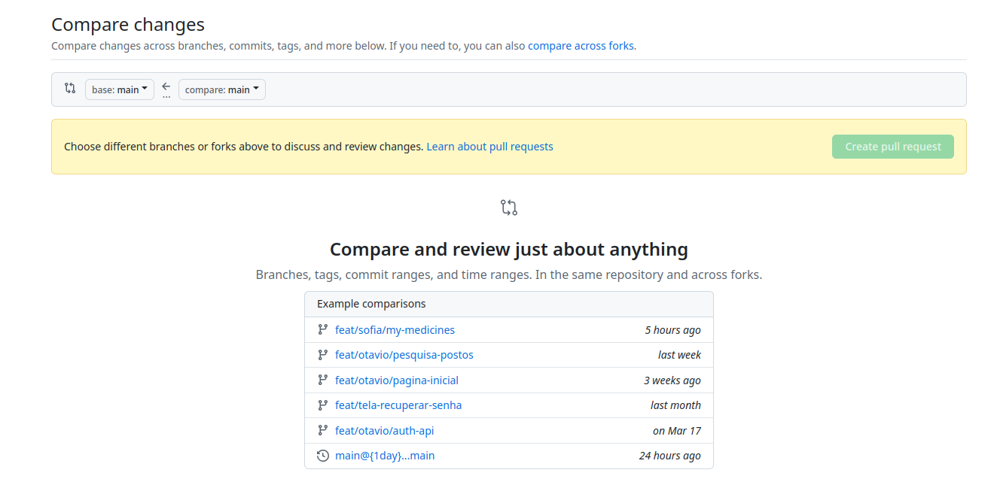

# Principais comandos Git 

Aqui serão registrados os principais comandos Git citados durante meu estudo de DevOps.


### Criar um novo repositório:


1. Criar diretório no /home do usuário
   ```sh
   mkdir ~/<nome-do-repositorio>
   # obs: deve-se digitar o ~/ para que o diretório seja criando dentro 
   # do /home/<nomedousuario> e não em um outro diretório qualquer.
   ```
2. Entrar no diretório recém criado
   ```sh
   cd ~/<nome-do-repositorio>
   # obs: deve-se digitar o ~/ para que o usuário entre no diretório certo.
   ```
3. Agora deve-se criar o repositório no GitHub com o mesmo nome do 
   diretório ao qual ele se será conectado.
    
4. O usuário deve entrar no seu perfil do github.com e clicar no botão
   verde *new* que aparece no canto superior esquerdo da tela.

5. Retorne ao terminal e crie o repositório seguindos os comandos:
   ```sh
   echo "# <nome-do-usuario>" >> README.md
   git init
   git add README.md
   git commit -m "first commit"
   git remote add origin git@gitbub.com:<nome-do-usuario>/<nome-do-repositorio>.git
   git push -origin main (ou o nome da branch em que você está trabalhando)
   ```

### Enviar um código novo

1. Criar a nova branch
   ```sh
   git checkout -b <nome da branch> - esse comando criará uma nova branch e já nos coloca dentro dela.
   ```

2. Fazer as alterações/inclusões necessárias no código.
   
3. Adicionar os arquivos na árvore
   ```sh
   git add . (o ponto é para que todos os arquivos alterados/novos sejam adicionados na árvore)
   Caso queira adicionar apenas um arquivo específico, deve-se digitar o caminho e o nome dele, por exemplo:
   git add <caminho-do-arquivo/nome-do-arquivo>
   git comiit
   ```

4. Fazer o commit

   ```sh
   git commit -m <informações-sobre-o-que-foi-adicionado-e-ou-alterado>
   ```
5. Fazer o push (o push é o momento em que o código será enviado ao servidor remoto)
   ```sh
   git push <remoto> <nome da branch> 
   ```
   Geralmente o nome do remoto é origin, mas pode ter variações.
   
6. Fazer o pull request (PR), na página do GitHub:
   1. abrir a aba Pull Request
   2. clicar no botão "new pull request"
   3. quando estiver na sessão "compare changes", selecione, no bloco "base" a branch que receberá as alterações (geralmente é a main) e no bloco "compare" defina a branch que possui as mudanças que serão recebidas pela "base".
      
   5. 
7. 
8.  
   É indicado que no PR seja informadas todas as atividades realizadas e assim ajudar a pessoa que revisará o código.
   Caso exista uma issue referente a esse PR, pode-se incluir na descrição dele o termo "closes #<numero-da-issue>

### Puxar possíveis alterações que estejam no remoto

1. Primeiro você deve ver em qual branch você está
   ```sh
   git branch
   ```
   Esse comando retornará uma listagem com as branchs disponíveis e um * identifirá em qual delas você está.

2. Caso você precise mudar de branch
   ```sh
   git checkout <nome da branch> 
   ``` 

3. Então traga as mudanças para a sua máquina local
   ```sh
   git pull
   ```

   # git fetch - para atualizar as branchs