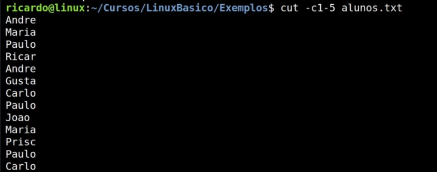

## Pesquisa de arquivos

# find - usado quando não sabemos onde está o arquivo

ex: find /home/NomeDeUmArquivoEspecifico

ex: find /home/sofia -name Aula10

ex: ./ -name Aula1

(o ./ define que a pesquisa será executada no diretório atual)

# para pesquisar tudo que comece com determinado nome - inclui-se o * depois do nome

ex: find ./ -name Aula1*

ex: ind ./ -name Aula1* -user sofia (a usuária dona do arquivo seja a sofia)

# locate usa a base de dados 
Nele só é consultada a base interna de diretório (é mais rápido do que o find)

Caso você esteja procurando um documento recém criado, certamente ele não será encontrado, pois a base de dados interna ainda não terá sido atualizada.

Para atualizar o banco de dadaos, deve ser rodado o comando *updatedb* (ele só pode rodar pelo root)
ex: locate rpm

# whereis - pesquisa por executáveis, bibliotecas, manuais, arquivos de configuração (etc) e fontes

usado para procurar a localização de um comando 

ex: whereis touch

# whitch

só procura nos diretórios do PATH
ele para assim que encontra o termo pela primeira vez e não continua a busva.

# cat 

usado para ler documentos
ex: cat ServidoresWeb.txt

# less

consegue ler o arquivo e ter funções de controle. Pagina o documento.

shift + N = irá subir o texto.

shift + G = irá para o final do arquivo

shift + g = irá para o começo do arquivo

Exemplos de pesquisas:

/ubuntu - pesquisa de baixo para cima

# Redirecionamento de arquivo

ao invés do comando cat apresentar os arquivos na tela, eles serão transformados em um novo arquivo. Se o arquivo já exister, ele perderá o seu conteúdo antigo.

Exemplo 1:

echo ServidoresWeb.txt > NovoArquivo
 
 Nesse caso, ao invés do arquivo ser apresentado na tela, o comando echo com o > irá redirecionar o arquivo.

 Exemplo 2:

 Nesse caso, a diferença é que, caso o arquivo já exista, ele não perderá seus arquivos antigos, mas sim concatená-los com os novos.

 echo ServidoresWeb.txt >> NovoArquivo

 

# Tratamentos básicos em arquivos txt

Exemplo:

wc <nomeArquivo>

ele irá retornar o número de linhas, palavras e caracteres do arquivo.

wc -l <nomeArquivo> vai retornar apenas a quantidade de linhas

wc -w <nomeArquivo> vai retornar apenas a quantidade de letras

wc -c <nomeArquivo> vai retornar apenas a quantidade de bytes/caracteres

# Colocar um arquivo txt em ordem alfabética

sort <nomeArquivo>

Para colocar a ordem descrescente:

sort -r <nomeArquivo>

Para não haver repetição de palavras:

sort -u <nomeArquivo> ou uniq <nomeArquivo> 

Para apresentar o conteúdo do "segundo campo" do conteúdo:

sort -k2 <nomeArquivo>

Para criar um novo arquivo copiando um existe e o deixando ordenado ( ### vai criar um novo arquivo mesmo? ### )

sort <nomeArquivo> > <novoAquivo>

* Uniq
ele só identifica a repetição se os arquivos com o mesmo nome estiverem em sequência imediata

* Uniq -u
mostra apenas os nomes que não se repetem

* Uniq -d
mostra apenas os nomes repetidos

* Cut
seleciona partes específicas do arquivo

cut -c1-5 <nomeArquivo>

* pipe | ajuda a compilar comandos

* grep

funciona como um Ctrl + F

grep - c (irá contar quantas vezes foi encontrado o termo)

grep -v (irpa apresentar todos os termos, menos o que foi colocado na linha de comando)

* ps é o comando que mostra os processos do usuário atual PID
* ps -e (lista todos os processos do sistema)

# Ferramentas para monitorar os processos do sistema

* top - vê se a máquina está ativa, quantos usuários estão logados, quantos processos estão em execução, consumo de CPU, memória...

shft + M: começa mostrando o consumo de memória

* free
(é o avaliable que mostra a memória disponível, não o free)
mostra quantos da memória está livre e ocupada.

* free -h (mostra os dados de forma mais compreensível ao usuário (human) em Gb e não em Bite)

* uptime - mostra há quanto tempo a máquina está ligada, quantos usuários estão logados e quão carregada ela está.
  
* uname - mostra informações do sistema
* uname -r - mostra a distribuição do kernel que está sendo usada

### perguntar sobre partição ao vitor. ###